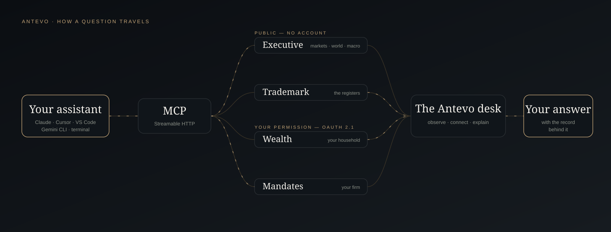

# Antevo MCP: four remote MCP servers for markets, trademarks, wealth and mandates

**Antevo's connections, for any assistant that speaks MCP.** The Executive Brief and its dated archive, the trademark registers, your own household and your firm's client book — four remote servers over Streamable HTTP. Two need no account. There is nothing to download and nothing to run.

[](https://github.com/ANTEVO-CH/antevo-mcp/actions/workflows/validate.yml)
[](https://registry.modelcontextprotocol.io/v0/servers?search=ch.antevo)
[](#the-servers)
[](https://www.npmjs.com/package/@antevo/cli)
[](LICENSE)

### Why Antevo

- **A named desk, not a web search.** Answers come from Antevo's published Executive Brief, the trademark registers themselves, and — when you sign in — your own record, with the date on every read.
- **Public where it can be, permissioned where it matters.** Executive and trademark screening reach no personal data. Wealth and Mandates sign in over OAuth 2.1 with PKCE.
- **Intelligence, not advice.** Nothing here places a trade or moves money.



## Table of Contents

- [The servers](#the-servers)
- [Install in your client](#install-in-your-client)
- [Quick Start](#quick-start)
- [Authentication](#authentication)
- [What this repository is](#what-this-repository-is)
- [Registry](#registry)
- [FAQ](#faq)
- [Security](#security)
- [License](#license)

## The servers

| | Server | Address | Access | Tools |
|:--|:--|:--|:--|--:|
| **I.** | **Executive** — the daily editorial read, risk radar, forward calendar, dated archive, desk reads, world-events map, macro-economic history | `https://api.antevo.ch/mcp/executive/mcp` | Public | 15 |
| **II.** | **Trademark** — screen a name, read a holder's filing pattern, check an opposition window | `https://trademark.antevo.ch/mcp` | Public screening | 4 |
| **III.** | **Wealth** — your household: holdings, allocation, risk, real assets, liabilities, goals, documents | `https://api.antevo.ch/mcp/wealth/mcp` | Your account | 36 |
| **IV.** | **Mandates** — your firm's client book: clients, reviews, meeting briefs, goals, documents, succession | `https://api.antevo.ch/mcp/mandates/mcp` | By arrangement | 24 |

Tool counts are read live from each server's `tools/list`. Every Wealth tool is read-only; Mandates can also change records in your own firm's book and asks for confirmation before anything irreversible.

## Install in your client

| Client | How |
|:--|:--|
| **Claude** — Code, Desktop, claude.ai | `/plugin marketplace add ANTEVO-CH/plugins`, then `/plugin install antevo-executive@antevo` — each connection with its skills. See [ANTEVO-CH/plugins](https://github.com/ANTEVO-CH/plugins). |
| **Cursor** | One click from [INSTALL.md](INSTALL.md), or install a plugin from [`plugins/`](plugins) — four plugins, take only what you need. |
| **VS Code** | One click from [INSTALL.md](INSTALL.md). |
| **Gemini CLI** | `gemini extensions install https://github.com/ANTEVO-CH/antevo-mcp` |
| **Windsurf, Zed, Goose, any MCP client** | Paste an address from [the servers](#the-servers) as a remote Streamable HTTP server. |
| **A terminal** | `npx @antevo/cli brief` — see [ANTEVO-CH/cli](https://github.com/ANTEVO-CH/cli). |

## Quick Start

```text
What happened in markets today, and what does the desk make of it?     → Executive
What could go wrong from here — and what would settle it?               → Executive
Has anyone filed anything close to "Novara"?                             → Trademark
Where am I concentrated?                                                 → Wealth, after sign-in
Which clients are due a review this month?                               → Mandates, after sign-in
```

## Authentication

- **Executive and Trademark screening** need no token. They are rate-limited per client and hold no personal data.
- **Wealth and Mandates** use OAuth 2.1 with PKCE and Dynamic Client Registration. Discovery is open — `initialize`, `tools/list` and `ping` answer without a token, so a client can inspect the surface before anyone signs in. Any `tools/call` without a token answers `401` with an RFC 9728 `WWW-Authenticate` challenge, and a compliant client completes sign-in on its own.
- Your assistant receives a scoped, short-lived token — never your password — and your account's own permissions apply.

## What this repository is

Connection metadata, and nothing else. There is no application code, no data and no business logic here — the servers are hosted by Antevo and are not open source.

| Path | What it is |
|:--|:--|
| [`registry/*/server.json`](registry) | Mirrors of the four published [MCP Registry](https://registry.modelcontextprotocol.io/v0/servers?search=ch.antevo) entries |
| [`.cursor-plugin/marketplace.json`](.cursor-plugin/marketplace.json) | The four plugins, for the Cursor marketplace |
| [`plugins/antevo-*/`](plugins) | Each plugin's `.cursor-plugin/plugin.json`, `mcp.json`, README and logo |
| [`gemini-extension.json`](gemini-extension.json) | Makes this repository a Gemini CLI extension |
| [`INSTALL.md`](INSTALL.md) | One-click install links for Cursor and VS Code |

CI runs on every push: every JSON file parses, Cursor's own [plugin-template validator](https://github.com/cursor/plugin-template) passes, and each `registry/*/server.json` still matches what is published.

## Registry

All four servers are listed and active in the official MCP Registry under the `ch.antevo` namespace, verified on the `antevo.ch` domain:

`ch.antevo/executive` · `ch.antevo/trademark` · `ch.antevo/wealth` · `ch.antevo/mandates`

## FAQ

### Do I need an account?

Not for Executive or trademark screening. Wealth needs an [Antevo Wealth](https://antevo.ch/wealth) account; Mandates needs a firm account, [by arrangement](https://antevo.ch/mandate).

### Why is Trademark on a different host?

It runs as a separate service at `trademark.antevo.ch`. It speaks Streamable HTTP only.

### What does my assistant receive?

The information a server returns to your question. Your chosen AI service handles it under its own terms.

### Does Antevo give investment advice?

No. It is editorial market intelligence, public-register data and a reading of your own record. Technical signals say how indicators lean, never buy or sell.

## Security

Report a vulnerability privately to **contact@antevo.ch** — see [SECURITY.md](SECURITY.md).

## License

The contents of this repository are MIT licensed — see [LICENSE](LICENSE) and [NOTICE](NOTICE). The Antevo services these files point at, and the Claude plugins and skills in [ANTEVO-CH/plugins](https://github.com/ANTEVO-CH/plugins), are not covered.

---

<p align="center">
  <b>Antevo</b> · Switzerland · <a href="https://antevo.ch">antevo.ch</a> · <a href="https://antevo.ch/mcp">Connect</a> · <a href="mailto:contact@antevo.ch">contact@antevo.ch</a><br>
  <sub>Intelligence, not advice.</sub>
</p>
